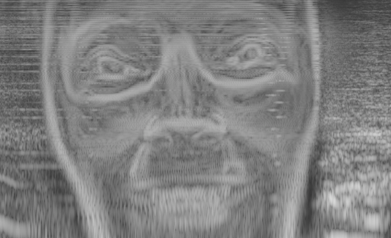

# Recreating the spectrogram face

I recently stumbled upon the face hidden in the spectrogram of the Aphex Twin track
called "[Equation](https://www.youtube.com/watch?v=M9xMuPWAZW8#t=328)".
Intrigued, I decided to try my hand at recreating the effect here on the web.

Visit http://danielrapp.github.io/spectroface/ to see the effect.
